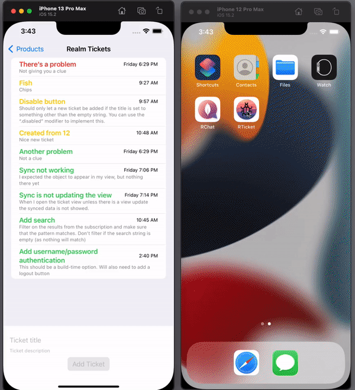

# RTicket iOS App
This is the iOS app for the RTracker app.



## Configure and Run
- Create the [backend Realm App](../Realm)
- Open `RTicket.xcodeproj` in Xcode
- Copy the Realm App ID from your RTicket backend Realm app, and paste it into `RTicketApp.swift`:

```swift
let realmApp = RealmSwift.App(id: "rticket-xxxxx")
```
- The app uses anonymous authentication by default, if you want to use email/password then update `useEmailPasswordAuth` in `RTicketApp.swift`:

```swift
let useEmailPasswordAuth = true
```

- Select your target in Xcode
- Build and run with `⌘R`

## Technology Stack
This app uses SwiftUI, Realm, and MongoDB Realm Sync.

The problem tickets are persisted locally in Realm. Those Realm objects are then automatically synced to any other device.

## Using the App

If you've enabled, email/password authentication then you can register new users within the app.

You can create new problem tickets against any of the products. You can swipe left and right to modify the status of an app:
- `notStarted` (red)
- `inProgress` (yellow)
- `complete` (green)
